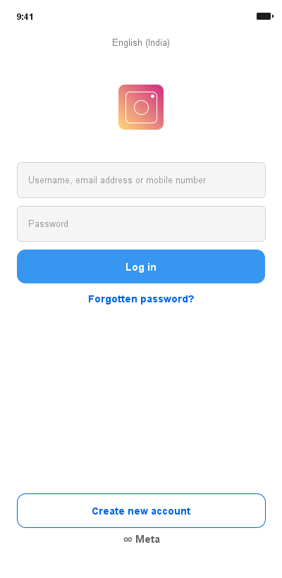
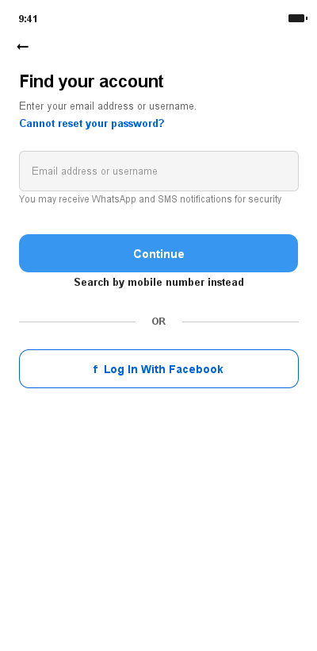
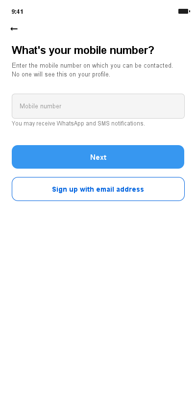
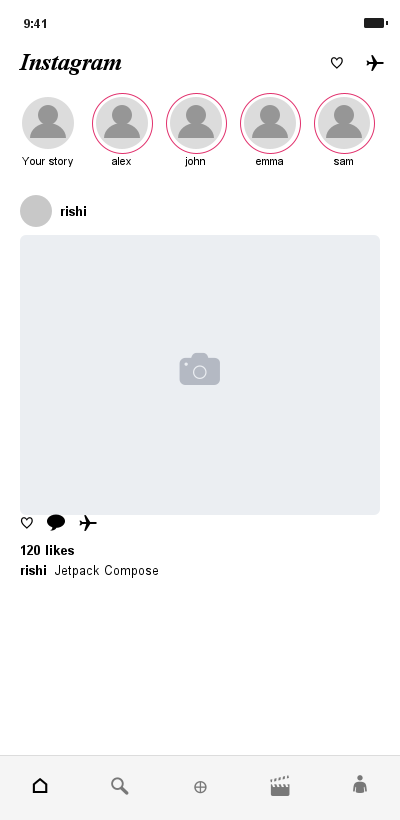
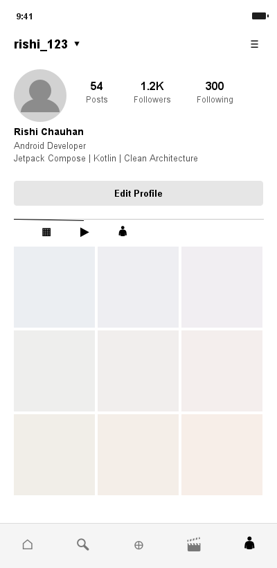

<div align="center">

  # 📸 Instagram UI Clone

  **A modern, pixel-perfect Instagram UI Clone built natively for Android using Jetpack Compose & Material 3.**

  [](https://developer.android.com/)
  [](https://kotlinlang.org/)
  [](https://developer.android.com/jetpack/compose)
  [](https://m3.material.io/)
  [](https://developer.android.com/about/versions/oreo)

</div>

---

## 📑 Table of Contents
- [✨ Key Features](#-key-features)
- [📱 App Previews & Flow](#-app-previews--flow)
- [🛠️ Tech Stack & Dependencies](#%EF%B8%8F-tech-stack--dependencies)
- [📐 Architecture & Project Structure](#-architecture--project-structure)
- [🌐 Localization](#-localization)
- [🚀 Getting Started](#-getting-started)
- [👤 Author](#-author)

---

## ✨ Key Features

### 🔐 Authentication & Onboarding
- 📱 **Instagram Login Screen**: Clean, responsive login screen with custom text fields, branded buttons, and official Meta/Instagram branding.
- 🔑 **Forgotten Password Flow**: Multi-step account lookup and verification interface (`ForgottenPasswordScreen1`, `ForgottenPasswordScreen2`).
- 📝 **Create New Account Flow**: Multi-step registration flow (`CreateNewAccountScreen1`, `CreateNewAccountScreen2`).

### 🏠 Main Instagram Application
- 🧭 **Top & Bottom Bar Navigation**: Material 3 Navigation Bar seamlessly switching between Feed and Profile.
- ⭕ **Stories Carousel**: Horizontal scrollable stories widget (`InstagramStories`) with custom story rings.
- 📰 **Home Feed**: Smooth scrollable post feed displaying user avatars, like counters, and captions (`InstagramPostItem`).
- 👤 **Profile Page**: Complete profile screen featuring post stats, bio section, edit profile action button, and grid/reels/tagged tabs (`ProfileHeaderSection`, `ProfileBioSection`, `ProfileTabs`).

### 🎨 Modern UI & Styling
- 🖼️ **Material 3 Theme**: Dark/Light mode color schemes with dynamic styling and custom typography.
- 📱 **Edge-to-Edge**: Full edge-to-edge layout support for modern Android devices.

---

## 📱 App Previews & Flow

| 🔐 Login Screen | 🔑 Password Recovery | 📝 Create Account |
| :---: | :---: | :---: |
|  |  |  |

| 🏠 Home Feed | 👤 Profile Page |
| :---: | :---: |
|  |  |

---

## 🛠️ Tech Stack & Dependencies

| Category | Technology |
| :--- | :--- |
| **Language** | [Kotlin](https://kotlinlang.org/) |
| **UI Framework** | [Jetpack Compose](https://developer.android.com/jetpack/compose) (BOM) |
| **Design System** | [Material Design 3](https://m3.material.io/) |
| **Navigation** | [Navigation Compose 2.9.6](https://developer.android.com/guide/navigation/navigation-compose) |
| **Icons** | Material Icons Extended |
| **Build Tooling** | Gradle Kotlin DSL (`build.gradle.kts`) with Version Catalog (`libs.versions.toml`) |

---

## 📐 Architecture & Project Structure

The project follows modern Android development practices with modularized UI components and declarative navigation:

```text
com.example.instalogin/
├── LoginActivity.kt              # Entry activity for Auth Flow & NavHost
├── HomeActivity.kt               # Entry activity for Instagram Main Flow (Feed & Profile)
├── Screen.kt                     # Navigation route definitions for Auth Flow
├── BottomNavItem.kt              # Navigation items definition for Bottom Bar
├── loginAppScreens/              # Composables & reusable UI components for Auth Flow
│   ├── InstaLoginScreen.kt
│   ├── ForgottenPasswordScreen1.kt
│   ├── ForgottenPasswordScreen2.kt
│   ├── CreateNewAccountScreen1.kt
│   ├── CreateNewAccountScreen2.kt
│   └── ... custom widgets (PrimaryButton, OutlinedButton, OutlinedTextField)
├── homeAppScreens/               # Composables for Home Feed and Profile pages
│   ├── BottomBarWidget.kt
│   ├── home/                     # TopBar, Stories, & Feed Post widgets
│   └── profile/                  # Profile TopBar, Header, Bio, & Tab widgets
└── ui/theme/                     # Theme setup (Color.kt, Theme.kt, Type.kt)
```

---

## 🌐 Localization

The app supports multiple languages out-of-the-box using Android string resources:
- 🇺🇸 **English** (`values/strings.xml`)
- 🇮🇳 **Hindi** (`values-hi/strings.xml`)

---

## 🚀 Getting Started

### Prerequisites
- **Android Studio**: Ladybug (2024.2.1) or newer
- **JDK**: JDK 11 or higher
- **Android SDK**: Compile SDK 36, Min SDK 26 (Android 8.0)

### Installation & Run

1. **Clone the repository**:
   ```bash
   git clone https://github.com/rishi-chauhan-496/InstaLoginPage.git
   cd InstaLoginPage
   ```

2. **Open in Android Studio**:
   - Launch Android Studio, select **Open**, and select the project directory.

3. **Build & Run**:
   - Allow Gradle to sync dependencies.
   - Select an emulator or connected physical device running Android 8.0+.
   - Click the **Run ▶** button or press `Shift + F10`.

---

## 👤 Author

**Rishi Chauhan**
- GitHub: [@rishi-chauhan-496](https://github.com/rishi-chauhan-496)

---

<div align="center">

*Made with ❤️ using Jetpack Compose*

</div>
